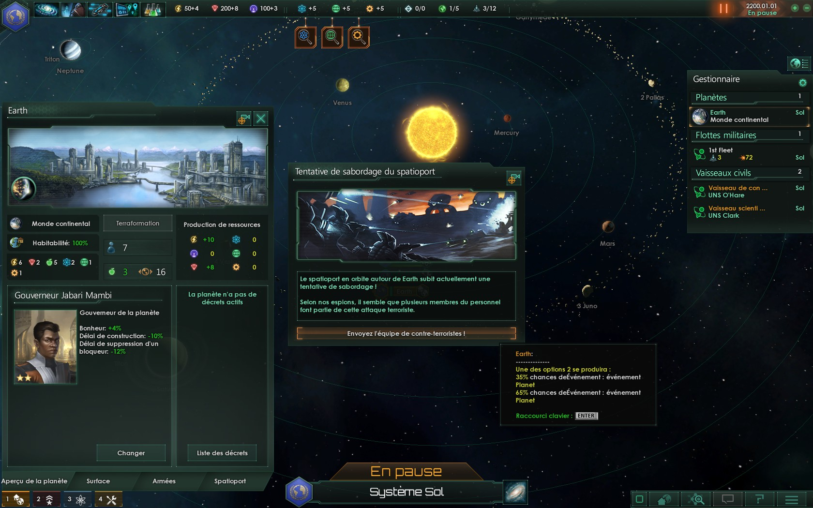
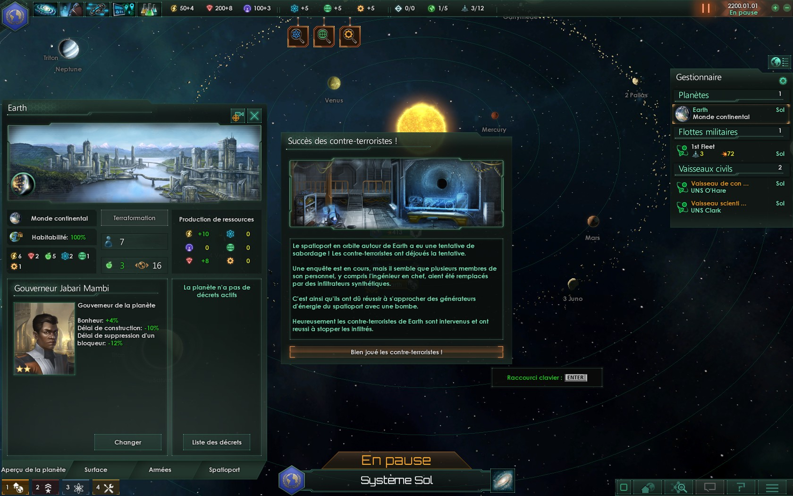

# Stellaris Mod

You can retrieve here in OpenSource Apache Licence V2.0,
the source code for this mods :

## Summary

* [Advanced Sector Planet](#advanced-sector-planet)
* [Metal Color](#metal-color)
* [Micro System](#micro-system)
* [SECTOR_PLANET_TO_50](#sector_planet_to_50)
* [SECTOR_PLANET_TO_100](#sector_planet_to_100)
* [Balance_crisis_event](#balance-crisis-event)

## Advanced Sector Planet

### STATS

* Mod : GamePlay
* Status Development : Interrupt
* Gamer : Not for begginner

### PROBLEM

Source Information : [WikiStellaris Defines](http://www.stellariswiki.com/Defines)
 <i>Defines are static and global: they apply to the whole game and cannot be changed dynamically.</i>
 I stop this development because system cannot be changed dynamically (this projet)
Not cool...

### SCREENSHOT

 

## Metal Color

<b>EN :</b> Add 5 metal colors
 <b>NOT Compatible with other mod : colors</b>

<b>FR :</b> Ajoute 5 couleurs métalliques
 <b>PAS Compatible avec d'autre mod : couleurs</b>

### STATS

* Mod : Utilities <i>Replace color file</i>
* Status Development : Complet
* Gamer : All

### SCREENSHOT

 

## Micro System

<b>EN :</b> This little mod add Micro System (100 stars) and Baby System (50 stars).
 Use for a very fast game.
 <b>Compatible with other mod : size of the galaxy</b>

<b>FR :</b> Ce petit mode ajoute Micro Système(100 étoiles) et Baby Système (50 étoiles).
 A utiliser pour les parties très rapides.
 <b>Compatible avec d'autre mod : taille de la galaxie</b>

### STATS

* Mod : GamePlay
* Status Development : Complet
* Gamer : Very fast game

### SCREENSHOT

 

## SECTOR_PLANET_TO_50

<b>EN :</b> This little mod changes the gameplay by enlarging the total number of planets from 5 to 50.
 <i>This mod is not recommended for new player (it breaks the game mechanics sectors).</i>

<b>FR :</b> Ce petit mode change le gameplay en élargissant le nombre total de planète de 5 à 50.
 <i>Ce mode n'est pas recommandé pour les nouveaux joueurs (il casse un peu la mécanique de secteur du jeu).</i>

### STATS

* Mod : GamePlay
* Status Development : Complet
* Gamer : Not for begginner

### SCREENSHOT

 

## SECTOR_PLANET_TO_100

<b>EN :</b> This little mod changes the gameplay by enlarging the total number of planets from 5 to 100.
 <i>This mod is not recommended for new player (it breaks the game mechanics sectors).</i>

<b>FR :</b> Ce petit mode change le gameplay en élargissant le nombre total de planète de 5 à 100.
 <i>Ce mode n'est pas recommandé pour les nouveaux joueurs (il casse un peu la mécanique de secteur du jeu).</i>

### STATS

* Mod : GamePlay
* Status Development : Complet
* Gamer : Not for begginner

### SCREENSHOT

 

## Balance Crisis Event

<b>EN :</b>This mode was created to balance the power of the events following the firepower players when it activates. This takes considered the balance of the power, adding random elements in sub events* and add possibilities of interactions.
 This mode is a answer to the no balancing in crisis events, inviting us on mods for deactivated it. Too bad, because this event is very cool.
 A greater percentage of survival is face up to these events, but crisis events not become "easy."

<b>FR :</b> Ce mode a été créer pour équilibrer la puissance des évènements suivant la puissance de feu des joueurs quand elle s'active. Cela prend en compte l'équilibrage des effectifs, l'ajout d'éléments aléatoire dans les events* annexes, et l'ajouts de possibilité d'intéraction.
 Ce mode est une réponse face à l'inexistance d'équilibrage dans les events crisis, nous invitans sur des modes à les désactivés, ceci étant dommage surtout par l'intéraction que cela fait de voir ces envahisseurs.
 Un plus grand pourcentage de survie est visible face à ces évènements, mais en aucun cas les évènements crisis deviennent "easy".

### STATS

* Mod : GamePlay, Balance
* Status Development : Work in Progress (2%)
* Gamer : For all

### SCREENSHOT EXAMPLE

### LOG

* Update Event crisis.2205 : Spaceport Scuttled (Random result)
* Add Event crisis.2225 : Success Counter Terrorist IA
* Add Event crisis.2235 : Failed Counter Terrorist IA
* Add French, English and Russian Language Event : crisis.2215, crisis.2225, crisis.2235

---

## LICENSE

[GNU GENERAL PUBLIC LICENSE V3](LICENSE)