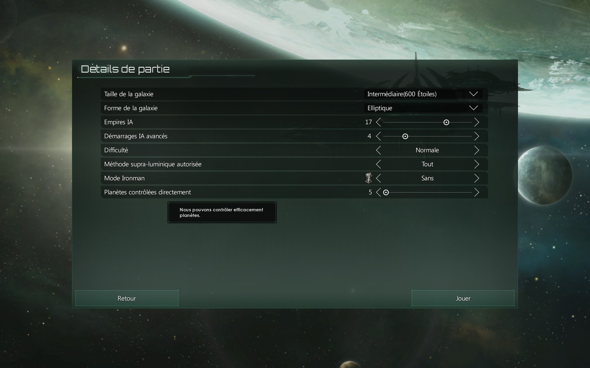
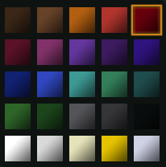
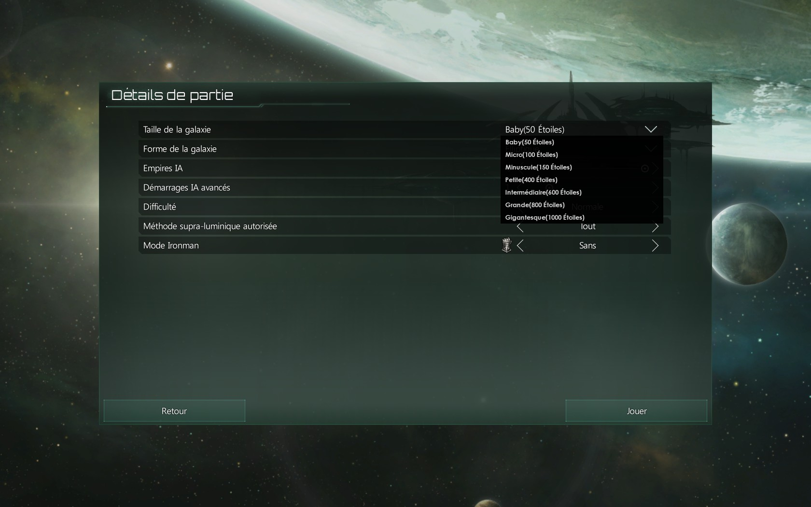
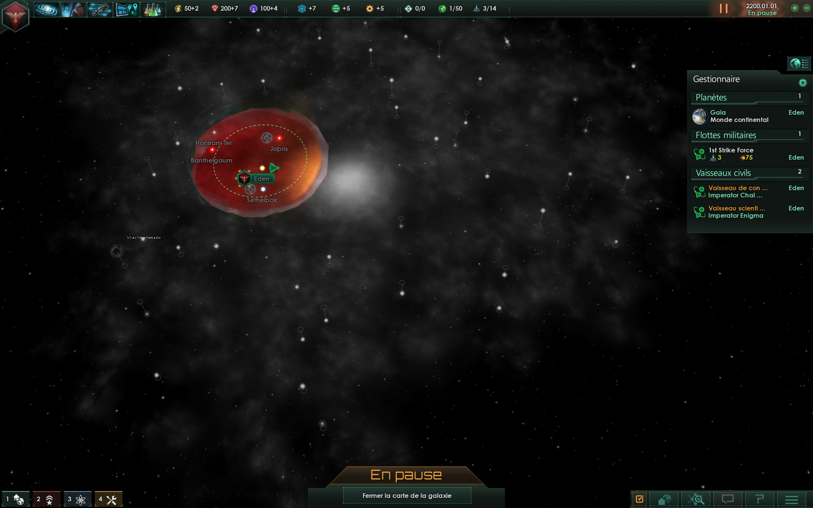
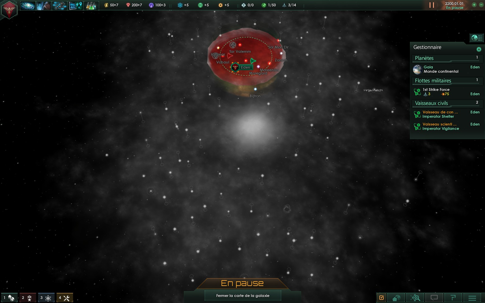
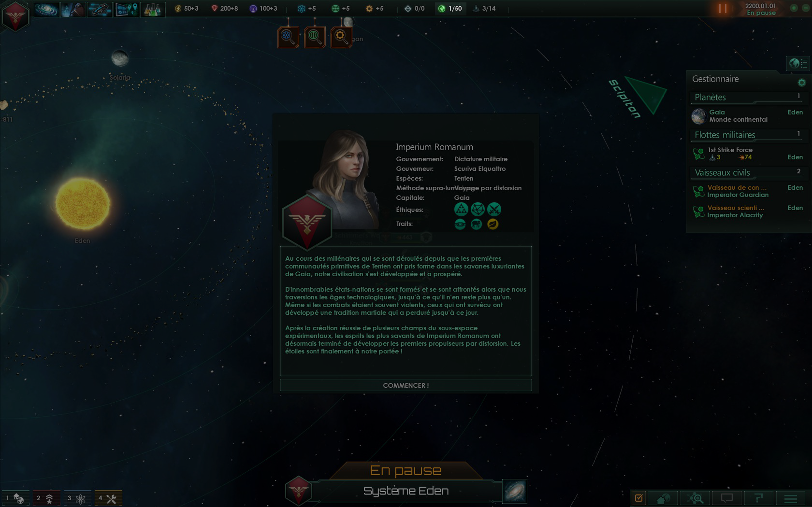
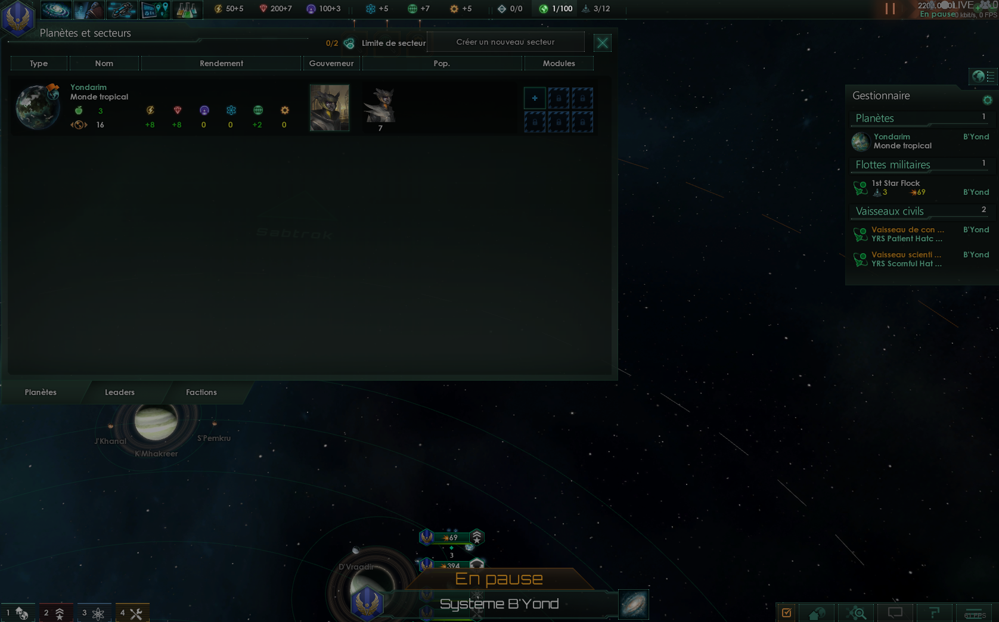
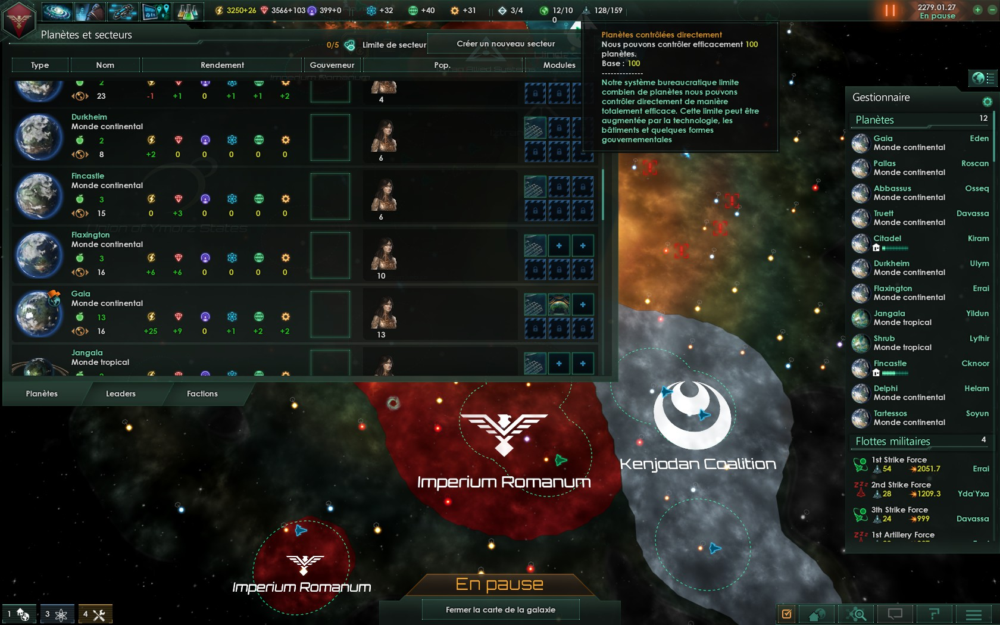

# Stellaris Mod

You can retrieve here in OpenSource Apache Licence V2.0,
the source code for this mods :

## Summary

* [Advanced Sector Planet](#advanced-sector-planet)
* [Metal_Color](#metal-color)
* [Micro_System](#micro-system)
* [SECTOR_PLANET_TO_50](#sector_planet_to_50)
* [SECTOR_PLANET_TO_100](#sector_planet_to_100)

## Advanced Sector Planet

### STATS

* Mod : GamePlay
* Gamer : Not for begginner
* Development : Stop

### PROBLEM

Source Information : [WikiStellaris Defines](http://www.stellariswiki.com/Defines)
 <i>Defines are static and global: they apply to the whole game and cannot be changed dynamically.</i>
 I stop this development because system cannot be changed dynamically (this projet)
Not cool...

### SCREENSHOT

 

## Metal Color

### STATS

* Mod : Utilities
<i>Replace color file</i>

### SCREENSHOT

 

## Micro System

### STATS

* Mod : GamePlay
* Gamer : Very fast game

### SCREENSHOT

 

## SECTOR_PLANET_TO_50

### STATS

* Mod : GamePlay
* Gamer : Not for begginner

### SCREENSHOT

 

## SECTOR_PLANET_TO_100

### STATS

* Mod : GamePlay
* Gamer : Not for begginner

### SCREENSHOT

---

## LICENSE

[Apache License Version 2.0](LICENSE)